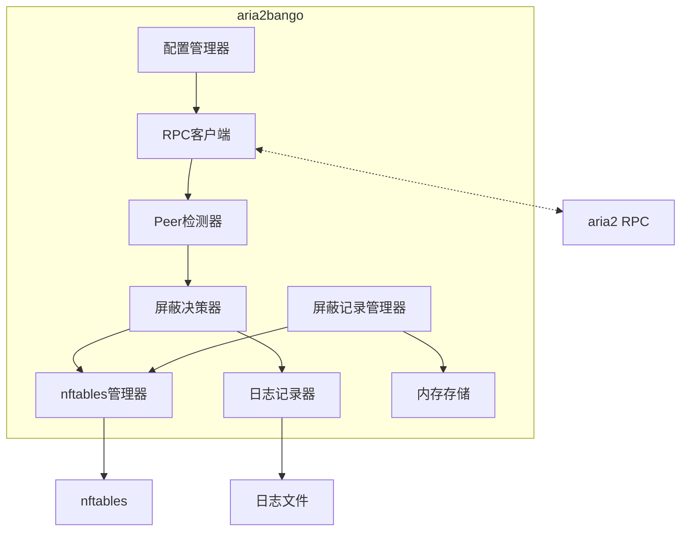
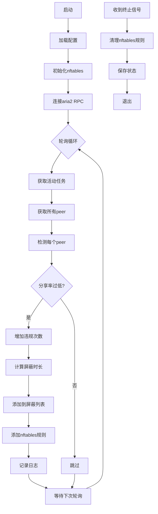

# aria2bango - 吸血BT客户端阻止程序设计方案

## 1. 项目概述

aria2bango是一个用于Linux服务器的Go程序，通过aria2 RPC接口监控BT下载的peer连接，自动检测并阻止吸血BT客户端。

### 核心功能
- 通过aria2 RPC获取活动peer信息
- 基于行为分析检测吸血客户端（分享率过低）
- 使用nftables临时屏蔽恶意IP（只阻止往外发包，不阻止收包）
- 累加惩罚机制：每次违规增加屏蔽时长
- 记录屏蔽日志到文件
- 支持配置化（行为阈值、屏蔽时间等）

## 2. 系统架构



## 3. 项目结构

```
aria2bango/
├── cmd/
│   └── aria2bango/
│       └── main.go           # 程序入口
├── internal/
│   ├── config/
│   │   └── config.go         # 配置管理
│   ├── aria2/
│   │   └── client.go         # aria2 RPC客户端
│   ├── detector/
│   │   └── detector.go       # 行为分析检测器
│   ├── firewall/
│   │   └── nftables.go       # nftables管理（使用set+timeout自动过期）
│   └── logger/
│       └── logger.go         # 日志记录
├── configs/
│   └── config.yaml           # 默认配置文件
├── scripts/
│   └── install.sh            # 安装脚本
├── systemd/
│   └── aria2bango.service    # systemd服务文件
├── go.mod
├── go.sum
├── Makefile
└── README.md
```

## 4. 模块设计

### 4.1 配置管理模块

配置文件采用YAML格式，支持以下配置项：

```yaml
# aria2 RPC配置
aria2:
  host: "127.0.0.1"
  port: 6800
  secret: ""           # RPC密钥
  poll_interval: 10s   # 轮询间隔

# 检测规则配置
detection:
  # 行为分析配置
  behavior:
    enabled: true
    # 分享率阈值（peer上传/peer下载），低于此值视为吸血
    min_share_ratio: 0.1
    # 最小统计数据量，低于此值不进行行为判断
    min_data_threshold: 10485760  # 10MB

# 屏蔽配置
blocking:
  # 基础屏蔽时长（累加惩罚的基数）
  # 第1次违规: 1 * base_duration = 5分钟
  # 第2次违规: 2 * base_duration = 10分钟
  # 第3次违规: 3 * base_duration = 15分钟
  # 以此类推...
  base_duration: 5m
  # nftables table名称
  nft_table: "aria2bango"

# 日志配置
logging:
  level: "info"
  file: "/var/log/aria2bango/blocked.log"
  max_size: 100        # MB
  max_backups: 3
  max_age: 30          # days
```

### 4.2 aria2 RPC客户端模块

主要功能：
- 连接aria2 RPC服务
- 获取活动下载任务列表
- 获取每个任务的peer信息

关键RPC方法：
- `aria2.tellActive()` - 获取活动任务
- `aria2.getPeers(gid)` - 获取指定任务的peer列表

Peer信息结构：
```go
type Peer struct {
    PeerID      string `json:"peerId"`
    IP          string `json:"ip"`
    Port        int    `json:"port"`
    Bitfield    string `json:"bitfield"`
    AmChoking   bool   `json:"amChoking"`
    PeerChoking bool   `json:"peerChoking"`
    DownloadSpeed int64 `json:"downloadSpeed"`
    UploadSpeed   int64 `json:"uploadSpeed"`
    Seeder       bool   `json:"seeder"`
}
```

### 4.3 Peer检测模块

#### 行为分析检测

基于peer的上传下载行为判断：

```go
type PeerStats struct {
    IP            string
    TotalDownload int64     // peer上传给我们的数据量
    TotalUpload   int64     // peer从我们下载的数据量
    FirstSeen     time.Time
    LastSeen      time.Time
    Violations    int       // 违规次数（累加惩罚）
    LastBlocked   time.Time // 上次屏蔽时间
}

// 判断是否为吸血行为
// shareRatio = peer上传 / peer下载
// 低分享率意味着peer下载多但上传少
func (s *PeerStats) IsLeeching(threshold float64) bool {
    if s.TotalUpload < minDataThreshold {
        return false  // 数据量太小，不做判断
    }
    shareRatio := float64(s.TotalDownload) / float64(s.TotalUpload)
    return shareRatio < threshold
}
```

#### 累加惩罚机制

每次检测到吸血行为，违规次数+1，屏蔽时长 = 违规次数 × 基础时长：

| 违规次数 | 屏蔽时长（基础5分钟） |
|---------|---------------------|
| 1 | 5分钟 |
| 2 | 10分钟 |
| 3 | 15分钟 |
| 4 | 20分钟 |
| ... | ... |

#### 自动恢复机制

屏蔽期满后，如果 peer 的分享率恢复正常（≥ min_share_ratio），违规次数会被重置为 0。这给 peer 一个重新参与公平分享的机会，避免永久屏蔽。

**工作流程**：
1. 检测到吸血行为 → 违规次数+1 → 屏蔽
2. 屏蔽期满 → 检查分享率
3. 如果分享率正常 → 重置违规次数 → 恢复正常
4. 如果分享率依然低 → 违规次数继续累加 → 屏蔽时间更长

### 4.4 nftables管理模块

使用独立的nftables table管理屏蔽规则，**只阻止往外发包，不阻止收包**：

```bash
# 创建table和set
table inet aria2bango {
    set blocked_v4 {
        type ipv4_addr
        flags timeout
        elements = {
            192.168.1.100 timeout 5m,
            10.0.0.50 timeout 10m
        }
    }
    
    set blocked_v6 {
        type ipv6_addr
        flags timeout
    }
    
    chain output {
        type filter hook output priority 0
        policy accept
        ip daddr @blocked_v4 drop    # 阻止发往被屏蔽IP的数据包
        ip6 daddr @blocked_v6 drop   # 但允许从他们接收数据
    }
}
```

**关键设计说明**：
- 使用 `output` chain 而非 `input` chain
- 匹配 `daddr`（目的地址）而非 `saddr`（源地址）
- 这样可以阻止吸血程序从我们这里下载，但不阻止我们从他们那里下载

关键操作：
- `Init()` - 初始化table和set
- `BlockIP(ip, duration)` - 添加IP到屏蔽set，设置超时
- `UnblockIP(ip)` - 从set中移除IP
- `Clear()` - 清空所有屏蔽规则
- `ListBlocked()` - 获取当前屏蔽的IP列表

### 4.5 日志记录模块

记录屏蔽事件到文件，格式如下：

```json
{
    "timestamp": "2024-01-15T10:30:00Z",
    "event": "blocked",
    "ip": "192.168.1.100",
    "peer_id": "-XL0019-xxx",
    "client_name": "Unknown",
    "reason": "low_share_ratio",
    "duration": "15m0s",
    "download_speed": 1048576,
    "upload_speed": 1024,
    "share_ratio": 0.001
}
```

### 4.6 屏蔽记录管理模块

维护内存中的屏蔽状态，用于：
- 跟踪每个被屏蔽IP的违规次数
- 计算累加惩罚时长
- 提供API查询当前屏蔽状态

```go
type BlockRecord struct {
    IP          string
    Violations  int           // 违规次数
    BlockedAt   time.Time
    ExpiresAt   time.Time
    ShareRatio  float64
}
```

## 5. 主程序流程



## 6. 依赖库

| 库 | 用途 |
|----|------|
| gopkg.in/yaml.v3 | YAML解析 |
| github.com/google/nftables | nftables操作 |
| go.uber.org/zap | 结构化日志 |

## 7. 部署方式

### 7.1 systemd服务

```ini
[Unit]
Description=Aria2 Bango - BT Leecher Blocker
After=network.target aria2.service
Requires=aria2.service

[Service]
Type=simple
User=root
ExecStart=/usr/local/bin/aria2bango -config /etc/aria2bango/config.yaml
ExecStopPost=/usr/local/bin/aria2bango -cleanup
Restart=on-failure
RestartSec=5s

[Install]
WantedBy=multi-user.target
```

### 7.2 权限要求

程序需要root权限运行，原因：
- 操作nftables需要CAP_NET_ADMIN能力
- 建议通过Linux capabilities而非root用户运行：
  ```bash
  setcap cap_net_admin+ep /usr/local/bin/aria2bango
  ```

## 8. 设计决策

### 8.1 为什么移除特征匹配？

特征匹配虽然简单直接，但存在以下问题：
- **误判风险**：即使是迅雷等客户端，也不一定都在吸血，有些用户可能只是使用该客户端但分享率正常
- **特征过时**：客户端特征可能随版本更新而变化
- **规避容易**：吸血客户端可以轻易修改Peer ID来规避检测

基于行为分析的方法更加公平和准确：
- 只看实际行为，不看出身
- 分享率是客观指标，难以伪造
- 避免误判正常使用的用户

### 8.2 为什么只阻止往外发包？

- **不影响下载**：我们仍然可以从吸血客户端下载数据
- **阻止上传**：阻止他们从我们这里获取数据
- **惩罚与保护并重**：既惩罚吸血行为，又不影响我们的下载体验

### 8.3 累加惩罚机制

- **渐进式惩罚**：初犯轻罚，累犯重罚
- **自动恢复**：屏蔽期满后自动解除，给改正机会
- **持续违规加重**：如果持续吸血，惩罚会越来越重

## 9. 后续扩展

- [ ] Web UI界面
- [ ] 白名单功能
- [ ] 持久化屏蔽记录到数据库
- [ ] 支持自定义惩罚策略
